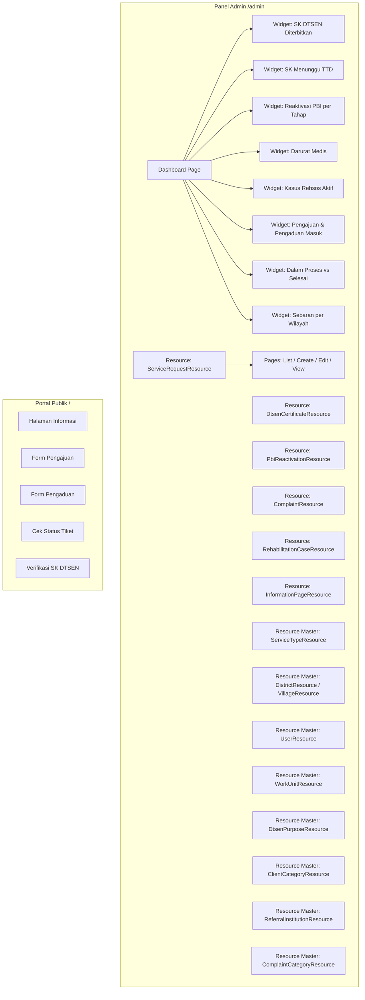
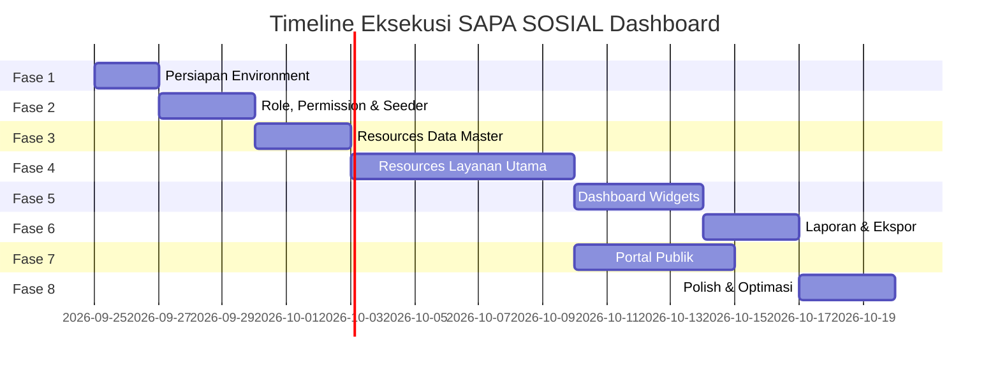

# 🚀 Rencana Aksi — Dashboard SAPA SOSIAL (Filament v5.8.4)

> **Proyek:** SAPA SOSIAL — Satu Pintu Layanan Sosial Kabupaten Blitar
> **Stack:** Laravel 13 · Filament v5.8.4 · Livewire v4 · PostgreSQL
> **Tanggal:** 25 September 2026

---

## Status Proyek Saat Ini

| Komponen | Status |
|----------|--------|
| Laravel project | ✅ Selesai (Laravel 13.32) |
| Database models (30 model) | ✅ Selesai |
| Migrasi database & Spatie tables | ✅ Selesai (17 migrasi) |
| PHP Enums (13 enum) | ✅ Selesai |
| Model traits (`HasStatusHistories`, `HasApprovals`, `HasDispositions`) | ✅ Selesai |
| Filament panel provider (`AdminPanelProvider`) | ✅ Selesai (Teal brand, notifications, navigation groups) |
| Paket pendukung (Spatie, Dompdf, QRCode, Excel, Boost) | ✅ Selesai |
| Seeder, Role & Permission (Spatie) | ✅ Selesai (6 Role, granular permissions) |
| Filament Resources Data Master (Fase 3) | ✅ Selesai (10 Resources) |
| Filament Resources Layanan Utama (Fase 4) | ✅ Selesai (ServiceRequest, Rehab, Complaint, InfoPage + RelationManagers) |
| Dashboard Widgets (Fase 5) | ⏳ Siap Dikerjakan |
| Laporan & Ekspor (Fase 6) | ⏳ Menunggu |
| Portal Publik Livewire (Fase 7) | ⏳ Menunggu |

> [!IMPORTANT]
> PHP dan Composer **tidak tersedia di PATH** terminal saat ini. Laragon memiliki PHP 8.4.25 di `C:\laragon\bin\php\php-8.4.25-Win32-vs17-x64\` dan Composer di `C:\laragon\bin\composer\`. Pastikan **menjalankan terminal melalui Laragon** (klik kanan Laragon → Terminal) agar PATH terisi otomatis, atau tambahkan secara manual.

---

## Arsitektur Dashboard



---

## Fase 1 — Persiapan Environment & Paket Pendukung
**Estimasi: 1–2 hari**

### 1.1 Konfigurasi PATH & Verifikasi Tools

- [ ] Buka terminal melalui **Laragon** (agar `php` dan `composer` tersedia di PATH)
- [ ] Jalankan `php -v` → pastikan PHP 8.4+
- [ ] Jalankan `composer -V` → pastikan Composer tersedia
- [ ] Jalankan `php artisan --version` → pastikan Laravel berjalan

### 1.2 Konfigurasi Environment

- [ ] Update [`.env`](file:///c:/laragon/www/app-layanan/.env):
  ```env
  APP_NAME="SAPA SOSIAL"
  APP_LOCALE=id
  APP_FALLBACK_LOCALE=id
  APP_FAKER_LOCALE=id_ID
  APP_TIMEZONE=Asia/Jakarta
  ```
- [ ] Pastikan koneksi PostgreSQL berfungsi: `php artisan db:show`

### 1.3 Install Paket Pendukung

- [ ] `composer require spatie/laravel-permission` — Role & permission management
- [ ] `composer require spatie/laravel-activitylog` — Audit log
- [ ] `composer require barryvdh/laravel-dompdf` — Generate PDF surat
- [ ] `composer require simplesoftwareio/simple-qrcode` — QR code verifikasi
- [ ] `composer require maatwebsite/excel` — Ekspor laporan Excel
- [ ] Publish config & migration setiap paket
- [ ] Jalankan `php artisan migrate`

### 1.4 Install Laravel Boost (sesuai AGENTS.md)

- [ ] `composer require laravel/boost --dev`
- [ ] `php artisan boost:install`

---

## Fase 2 — Setup Role, Permission & Seeder Data Master
**Estimasi: 2–3 hari**

### 2.1 Konfigurasi Spatie Permission

- [ ] Buat seeder roles: `Administrator`, `Petugas Dinsos`, `Pejabat Penandatangan`, `Pimpinan`, `Operator Kecamatan/Desa`, `Masyarakat`
- [ ] Buat permission granular per modul:

| Modul | Permissions |
|-------|------------|
| service_requests | `view_any`, `view`, `create`, `update`, `delete`, `verify`, `approve` |
| dtsen_certificates | `view_any`, `view`, `create`, `check_siksng`, `issue`, `sign` |
| pbi_reactivations | `view_any`, `view`, `create`, `verify_eligibility`, `sign`, `propose_ministry` |
| rehabilitation_cases | `view_any`, `view`, `create`, `update`, `assess`, `refer`, `monitor`, `close` |
| complaints | `view_any`, `view`, `create`, `update`, `verify`, `dispatch`, `resolve` |
| information_pages | `view_any`, `view`, `create`, `update`, `publish`, `archive` |
| users | `view_any`, `view`, `create`, `update`, `delete`, `assign_roles` |
| master_data | `view_any`, `view`, `create`, `update`, `delete` |
| reports | `view`, `export` |

- [ ] Assign permissions ke setiap role

### 2.2 Update Model User

- [ ] Tambahkan `HasRoles` trait dari Spatie ke model [`User`](file:///c:/laragon/www/app-layanan/app/Models/User.php)
- [ ] Tambahkan `LogsActivity` trait dari Spatie ke model yang perlu audit

### 2.3 Seeder Data Master

- [ ] Seeder `DistrictSeeder` — Data kecamatan Kabupaten Blitar (22 kecamatan)
- [ ] Seeder `VillageSeeder` — Data desa/kelurahan per kecamatan
- [ ] Seeder `WorkUnitSeeder` — Unit kerja Dinas Sosial (Sekretariat, Bidang Perlindungan Jaminan Sosial, Bidang Rehabilitasi Sosial, Bidang Pemberdayaan Sosial, dll.)
- [ ] Seeder `ServiceTypeSeeder` — Jenis layanan (DTSEN, PBI, REHSOS, Layanan Umum)
- [ ] Seeder `ServiceRequirementSeeder` — Persyaratan per jenis layanan
- [ ] Seeder `DtsenPurposeSeeder` — Tujuan SK DTSEN (SPMB, PIP, KIP Kuliah, Bansos, Kesehatan, Lainnya) + batas desil
- [ ] Seeder `ClientCategorySeeder` — Kategori klien rehsos
- [ ] Seeder `ComplaintCategorySeeder` — Kategori pengaduan
- [ ] Seeder `ReferralInstitutionSeeder` — Lembaga rujukan
- [ ] Seeder `NumberSequenceSeeder` — Initial number sequence
- [ ] Seeder `UserSeeder` — User demo per role
- [ ] Buat `DatabaseSeeder` yang memanggil semua seeder di atas dalam urutan yang benar
- [ ] Jalankan `php artisan db:seed`

---

## Fase 3 — Filament Resources: Data Master
**Estimasi: 2–3 hari**

> [!NOTE]
> Gunakan **Filament v5 Schemas API** (`Filament\Schemas\Schema`, `$schema->components([...])`) — **bukan** API v3 (`HasForms`/`InteractsWithForms`, `Form $form`). Ikon menggunakan enum `Heroicon`.

### 3.1 Resource CRUD Data Master

Buat resource Filament untuk setiap tabel master:

| Resource | Model | Navigation Group | Fitur |
|----------|-------|-------------------|-------|
| [`UserResource`] | `User` | Manajemen Pengguna | CRUD + assign role, filter wilayah, toggle aktif |
| [`WorkUnitResource`] | `WorkUnit` | Data Master | CRUD sederhana, toggle aktif |
| [`DistrictResource`] | `District` | Data Master → Wilayah | CRUD, relasi ke villages |
| [`VillageResource`] | `Village` | Data Master → Wilayah | CRUD, filter district |
| [`ServiceTypeResource`] | `ServiceType` | Data Master → Layanan | CRUD, relation manager requirements |
| [`ServiceRequirementResource`] | `ServiceRequirement` | — | Relation manager di ServiceType |
| [`DtsenPurposeResource`] | `DtsenPurpose` | Data Master → Layanan | CRUD, max_decile, validity_days |
| [`ClientCategoryResource`] | `ClientCategory` | Data Master → Rehsos | CRUD sederhana |
| [`ComplaintCategoryResource`] | `ComplaintCategory` | Data Master → Pengaduan | CRUD sederhana, toggle aktif |
| [`ReferralInstitutionResource`] | `ReferralInstitution` | Data Master → Rehsos | CRUD, toggle aktif |
| [`NumberSequenceResource`] | `NumberSequence` | Data Master → Sistem | View only + reset counter |

### 3.2 Policy per Resource

- [ ] Buat Policy untuk setiap model master
- [ ] Register policy di `AuthServiceProvider`
- [ ] Pastikan hanya `Administrator` dan role yang sesuai bisa mengakses

---

## Fase 4 — Filament Resources: Layanan Utama
**Estimasi: 5–7 hari** ⭐ *Fase terbesar*

### 4.1 Layanan 1 — SK DTSEN (`ServiceRequestResource` + `DtsenCertificateResource`)

**Schema Form (Create/Edit):**
- [ ] Section "Data Pemohon": `applicant_name`, `applicant_nik`, `family_card_number`, `address`, `village_id` (Select dengan search, cascade district→village), `phone`
- [ ] Section "Data yang Diterangkan": `subject_name`, `subject_nik`, `relationship_to_applicant`
- [ ] Section "Tujuan Penggunaan": `dtsen_purpose_id` (Select), `purpose_description`
- [ ] Section "Dokumen Persyaratan": Repeater/FileUpload per requirement (KTP, KK)

**Schema Table (List):**
- [ ] Kolom: `request_number`, `applicant_name`, `applicant_nik`, `purpose` (dari relasi), `status` (Badge berwarna), `submitted_at`, `officer`
- [ ] Filter: status, tujuan penggunaan, kecamatan, desa, periode
- [ ] Bulk action: export Excel

**Actions (Status Transition):**
- [ ] `VerifyDocumentAction` → document_check: petugas tandai dokumen valid/perlu revisi
- [ ] `RequestRevisionAction` → revision_requested: minta perbaikan
- [ ] `CheckSiksngAction` → data_verification: input hasil cek SIKS-NG (terdaftar/tidak, desil, tanggal cek)
  - Validasi: jika desil > `dtsen_purposes.max_decile` → **wajib reject**
  - Validasi duplikasi: cek surat berlaku untuk pemohon+tujuan yang sama
- [ ] `SubmitForApprovalAction` → awaiting_approval: buat draf surat, kirim ke approval chain
- [ ] `ApproveAction` (Kabid paraf → Kadis TTD) → issued: generate nomor surat, PDF + QR, file surat
- [ ] `RejectAction` → rejected: wajib isi alasan
- [ ] `CompleteAction` → completed: surat diambil/diunduh

**View page:**
- [ ] Infolist lengkap dengan semua data + timeline status_histories
- [ ] Tab: Detail Pemohon | Hasil Verifikasi SIKS-NG | Surat | Riwayat Persetujuan | Log Aktivitas

### 4.2 Layanan 2 — Reaktivasi PBI-JK (`ServiceRequestResource` + `PbiReactivationResource`)

**Schema Form (Create/Edit):**
- [ ] Section "Data Pemohon": (sama dengan DTSEN)
- [ ] Section "Data Peserta PBI": `participant_name`, `participant_nik`, `bpjs_card_number`, `deactivated_date`, `reason` (Select enum PbiReason), `health_facility_name`, `health_letter_number`
- [ ] Section "Dokumen": KTP, KK, Kartu BPJS/KIS, Surat Keterangan Faskes (wajib jika alasan medis)

**Actions khusus:**
- [ ] `VerifyEligibilityAction` → eligibility_verification: cek desil, kelayakan
- [ ] `IssueRecommendationAction` → recommendation_issued: buat surat rekomendasi + approval chain
- [ ] `ProposeToMinistryAction` → proposed_to_ministry: catat tanggal input SIKS-NG
- [ ] `RecordMinistryDecisionAction` → ministry_approved/ministry_rejected
- [ ] `ConfirmReactivationAction` → reactivated/completed: catat tanggal aktif kembali

**Aturan khusus:**
- [ ] Pengajuan `reason = emergency` → auto set `is_priority = true` → tampil paling atas
- [ ] Pengajuan tertahan di `proposed_to_ministry` > batas hari → badge "Perlu Tindak Lanjut"

### 4.3 Layanan 4 — Pengajuan Layanan Umum (`ServiceRequestResource`)

- [ ] Gunakan `ServiceRequestResource` yang sama, difilter via `service_type.handler = 'generic'`
- [ ] Form dinamis berdasarkan `service_type_id` yang dipilih (requirements berubah)
- [ ] Actions generik: document_check → verification → (assessment opsional) → in_process → completed

### 4.4 Layanan 3 — Rehabilitasi Sosial (`RehabilitationCaseResource`)

**Schema Form:**
- [ ] Section "Data Klien": `client_id` (Select/Create), kategori, identitas
- [ ] Section "Sumber Kasus": link ke `service_request_id` atau `complaint_id` (opsional)
- [ ] Section "Penanganan": `handling_type`, `officer_id`

**Relation Managers:**
- [ ] `AssessmentsRelationManager` — CRUD assessment, field `needs_referral`
- [ ] `ReferralsRelationManager` — CRUD rujukan (hanya jika assessment `needs_referral = true`)
- [ ] `MonitoringRecordsRelationManager` — CRUD monitoring

**Actions:**
- [ ] `PerformAssessmentAction` → assessment
- [ ] `PlanServiceAction` → service_planning
- [ ] `StartServiceAction` → in_service
- [ ] `CreateReferralAction` → buat rujukan ke lembaga
- [ ] `AddMonitoringAction` → monitoring
- [ ] `CloseCaseAction` → closed (validasi: `handling_result` wajib diisi)

### 4.5 Layanan 5 — Pengaduan Sosial (`ComplaintResource`)

**Schema Form:**
- [ ] Section "Data Pelapor": `reporter_name`, `reporter_phone`
- [ ] Section "Detail Pengaduan": `complaint_category_id`, `location_detail`, `village_id`, `description`
- [ ] Section "Lampiran": FileUpload multiple (foto/dokumen)

**Actions:**
- [ ] `VerifyAction` → verification
- [ ] `RequestClarificationAction` → clarification_requested
- [ ] `DispatchAction` → dispatched (pilih unit/petugas)
- [ ] `HandleAction` → in_handling
- [ ] `ResolveAction` → resolved (wajib isi `action_taken`)
- [ ] `MarkDuplicateAction` → duplicate (pilih laporan induk)
- [ ] `CreateRehabCaseAction` → buat kasus rehsos dari pengaduan

---

## Fase 5 — Dashboard Widgets
**Estimasi: 3–4 hari** ⭐

### 5.1 Widget Stats Overview

| Widget | Tipe | Data |
|--------|------|------|
| `DtsenIssuedWidget` | `StatsOverviewWidget` | Jumlah SK DTSEN diterbitkan per periode, breakdown per tujuan & desil |
| `DtsenAwaitingSignatureWidget` | `StatsOverviewWidget` | Antrean draf menunggu paraf/TTD |
| `PbiPerStageWidget` | `StatsOverviewWidget` | Jumlah per status: verifikasi, menunggu Kemensos, aktif kembali, ditolak |
| `PbiEmergencyWidget` | `StatsOverviewWidget` | Pengajuan prioritas darurat medis yang belum selesai |
| `RehabActiveCasesWidget` | `StatsOverviewWidget` | Kasus aktif dalam assessment/pelayanan/monitoring + rujukan per lembaga |
| `IncomingRequestsWidget` | `StatsOverviewWidget` | Pengajuan & pengaduan baru per periode per jenis |
| `ProcessingVsCompletedWidget` | `StatsOverviewWidget` | Tiket belum selesai per status vs sudah selesai |

### 5.2 Widget Chart

| Widget | Tipe | Data |
|--------|------|------|
| `MonthlyTrendChart` | `ChartWidget` (Line) | Tren pengajuan/pengaduan per bulan |
| `ServiceByTypeChart` | `ChartWidget` (Doughnut) | Distribusi per jenis layanan |
| `RegionalDistributionChart` | `ChartWidget` (Bar) | Sebaran per kecamatan |
| `PbiTimelineChart` | `ChartWidget` (Line) | Timeline proses reaktivasi rata-rata |

### 5.3 Widget Tabel

| Widget | Tipe | Data |
|--------|------|------|
| `OverdueTicketsWidget` | `TableWidget` | Tiket tertahan melebihi SLA |
| `RecentActivityWidget` | `TableWidget` | Aktivitas terbaru (dari activity_log) |
| `PbiStuckProposalsWidget` | `TableWidget` | Reaktivasi PBI tertahan di `proposed_to_ministry` |

### 5.4 Filter Global Dashboard

- [ ] Filter **Periode** (date range picker)
- [ ] Filter **Jenis Layanan** (multi-select)
- [ ] Filter **Status** (multi-select)
- [ ] Filter **Kecamatan** (Select)
- [ ] Filter **Desa/Kelurahan** (Select, cascade dari kecamatan)
- [ ] Operator Kecamatan/Desa → **auto-filter** hanya data wilayahnya (via scope di model)

### 5.5 Custom Dashboard Page

- [ ] Buat custom Dashboard page `app/Filament/Pages/Dashboard.php` yang menggantikan default
- [ ] Atur layout grid 2–3 kolom untuk widget
- [ ] Implementasi filter header yang berlaku untuk semua widget
- [ ] Role-based widget visibility:
  - **Administrator**: semua widget
  - **Petugas Dinsos**: widget terkait layanan yang ditangani
  - **Pejabat Penandatangan**: widget approval queue
  - **Pimpinan**: semua widget (read-only)
  - **Operator Kecamatan/Desa**: widget dengan filter wilayah

---

## Fase 6 — Laporan & Ekspor
**Estimasi: 2–3 hari**

### 6.1 Halaman Laporan

- [ ] Buat page `app/Filament/Pages/Reports.php` dengan navigation group "Laporan"
- [ ] Sub-halaman atau tabs per jenis laporan:

| Laporan | Filter | Format Ekspor |
|---------|--------|---------------|
| Rekap SK DTSEN | Periode, tujuan, desil, kecamatan/desa | Excel, PDF |
| Rekap Reaktivasi PBI-JK | Periode, alasan, status, kecamatan/desa | Excel, PDF |
| Laporan Rehabilitasi Sosial | Periode, kategori klien, lembaga, status | Excel, PDF |
| Laporan Pelayanan (semua jenis) | Periode, jenis layanan, status, wilayah | Excel, PDF |
| Laporan Pengaduan | Periode, kategori, status, kecamatan/desa | Excel, PDF |

### 6.2 Implementasi Ekspor

- [ ] Buat Export class per laporan menggunakan `maatwebsite/excel`
- [ ] Buat PDF template per laporan menggunakan `barryvdh/laravel-dompdf`
- [ ] Gunakan **Laravel Queue** untuk ekspor besar (job `database` driver)
- [ ] Notifikasi Filament saat ekspor selesai (download link)

---

## Fase 7 — Portal Publik (Livewire v4)
**Estimasi: 3–5 hari**

### 7.1 Layout & Halaman

- [ ] Layout publik Livewire (header, footer, navigation) — Tailwind CSS v4
- [ ] Halaman Beranda (`/`) — Hero section + daftar layanan + statistik ringkas
- [ ] Halaman Informasi Layanan (`/layanan`) — List + detail + search
- [ ] Halaman Detail Informasi (`/layanan/{slug}`) — Deskripsi, persyaratan, alur, download formulir, FAQ

### 7.2 Form Pengajuan & Pengaduan

- [ ] Form Pengajuan Layanan (`/pengajuan`) — Livewire component, bisa memakai Filament Schemas (`HasSchemas` + `InteractsWithSchemas`)
  - Pilih jenis layanan → form dinamis sesuai persyaratan
  - Upload dokumen
  - Submit → nomor tiket
- [ ] Form Pengaduan Sosial (`/pengaduan`) — Livewire component
  - Kategori, lokasi, deskripsi, lampiran
  - Submit → nomor laporan

### 7.3 Cek Status & Verifikasi

- [ ] Cek Status Tiket (`/cek-status`) — Input nomor tiket + 4 digit terakhir NIK/HP → timeline status
- [ ] Verifikasi SK DTSEN (`/verifikasi/{code}`) — Scan QR / input kode → tampilkan data surat atau "tidak valid"

---

## Fase 8 — Polish & Optimasi
**Estimasi: 2–3 hari**

### 8.1 Konfigurasi Panel Filament

- [ ] Update [`AdminPanelProvider`](file:///c:/laragon/www/app-layanan/app/Providers/Filament/AdminPanelProvider.php):
  - Brand name: "SAPA SOSIAL"
  - Color scheme yang sesuai identitas Dinas Sosial
  - Navigation groups: Dashboard, Layanan (DTSEN, PBI, Umum), Rehabilitasi Sosial, Pengaduan, Informasi, Laporan, Data Master, Manajemen Pengguna
  - SPA mode enabled
  - Database notifications
  - Global search

### 8.2 Notifikasi Filament

- [ ] Notifikasi saat tiket baru masuk (ke petugas terkait)
- [ ] Notifikasi saat perlu approval (ke pejabat penandatangan)
- [ ] Notifikasi saat tiket tertahan melebihi SLA
- [ ] Notifikasi saat ekspor selesai

### 8.3 Optimasi & Keamanan

- [ ] Index database pada kolom filter (`status`, `village_id`, `service_type_id`, `submitted_at`)
- [ ] Eager loading relasi di setiap Resource (`$table->query()` optimasi)
- [ ] Policy enforcement di setiap Resource
- [ ] Scope query Operator Kecamatan/Desa → hanya data wilayahnya
- [ ] Disk `local` privat untuk dokumen sensitif + signed URL
- [ ] Activity log di setiap aksi penting

### 8.4 Scheduled Commands

- [ ] Command `MarkOverdueTickets` — tandai tiket melebihi SLA → `php artisan schedule:run`
- [ ] Command `MarkStuckPbiProposals` — tandai reaktivasi PBI tertahan
- [ ] Command `CleanExpiredCertificates` — update surat expired

### 8.5 Testing

- [ ] Feature tests per Resource (CRUD + aksi status)
- [ ] Unit tests per Enum (status transitions valid/invalid)
- [ ] Policy tests per role
- [ ] Test koneksi PostgreSQL (bukan SQLite)

---

## Urutan Eksekusi yang Direkomendasikan



**Total estimasi: 20–30 hari kerja** (4–6 minggu)

> [!TIP]
> Untuk pengembangan yang lebih cepat, Fase 5 (Dashboard Widgets) dan Fase 7 (Portal Publik) bisa dikerjakan **paralel** setelah Fase 4 selesai.

---

## Catatan Teknis Penting

### Filament v5 API (Bukan v3!)

```php
// ✅ BENAR — Filament v5 Schemas API
use Filament\Schemas\Schema;

public function schema(Schema $schema): Schema
{
    return $schema->components([
        TextInput::make('name')->required(),
    ]);
}

// ❌ SALAH — Filament v3 API (jangan dipakai)
use Filament\Forms\Form;

public function form(Form $form): Form { ... }
```

### Status Enum Pattern

```php
// Setiap status enum harus punya method label() bahasa Indonesia
enum ServiceRequestStatus: string
{
    case Submitted = 'submitted';
    case DocumentCheck = 'document_check';
    // ...
    
    public function label(): string
    {
        return match($this) {
            self::Submitted => 'Diajukan',
            self::DocumentCheck => 'Pemeriksaan Dokumen',
            // ...
        };
    }
}
```

### Transisi Status

```php
// Setiap transisi status harus melalui Action yang divalidasi
// dan otomatis menulis ke status_histories
$serviceRequest->transitionTo(ServiceRequestStatus::DocumentCheck, $notes);
```

---

## Mulai dari Mana?

Untuk memulai, saya rekomendasikan mengeksekusi **Fase 1 (Persiapan)** terlebih dahulu. Apakah Anda ingin saya langsung mulai mengerjakan fase tertentu?
